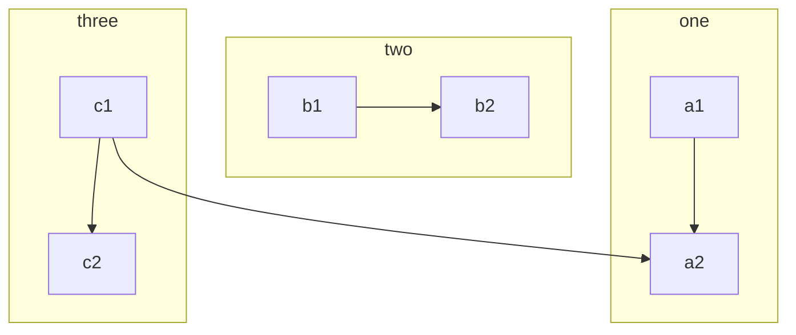
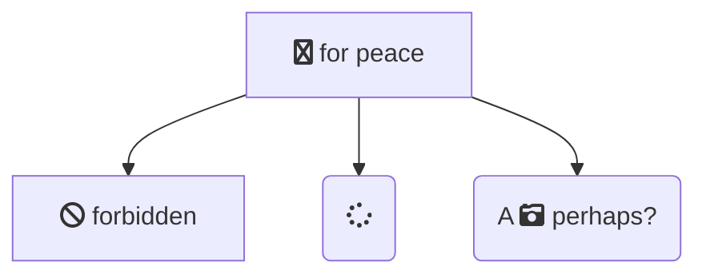

# Demo Markdown

## Mermaid

### Demo 1



### Demo 2



## PlantUML

### Demo 1

```plantuml
actor Bob #red
' The only difference between actor
'and participant is the drawing
participant Alice
participant "I have a really\nlong name" as L #99FF99
/' You can also declare:
   participant L as "I have a really\nlong name"  #99FF99
  '/

Alice->Bob: Authentication Request
Bob->Alice: Authentication Response
Bob->L: Log transaction
```

### Demo 2

```plantuml
Alice -> "Bob()" : Hello
"Bob()" -> "This is very\nlong" as Long
' You can also declare:
' "Bob()" -> Long as "This is very\nlong"
Long --> "Bob()" : ok
```

## ECharts

### Demo 1

```echarts
option = {
    animation:false,
    title : {
        text: '某站点用户访问来源',
        subtext: '纯属虚构',
        x:'center'
    },
    tooltip : {
        trigger: 'item',
        formatter: "{a} <br/>{b} : {c} ({d}%)"
    },
    legend: {
        orient: 'vertical',
        left: 'left',
        data: ['直接访问','邮件营销','联盟广告','视频广告','搜索引擎']
    },
    series : [
        {
            name: '访问来源',
            type: 'pie',
            radius : '55%',
            center: ['50%', '60%'],
            data:[
                {value:335, name:'直接访问'},
                {value:310, name:'邮件营销'},
                {value:234, name:'联盟广告'},
                {value:135, name:'视频广告'},
                {value:1548, name:'搜索引擎'}
            ],
            itemStyle: {
                emphasis: {
                    shadowBlur: 10,
                    shadowOffsetX: 0,
                    shadowColor: 'rgba(0, 0, 0, 0.5)'
                }
            }
        }
    ]
};
```

### Demo 2

```echarts
option = {
    animation:false,
    tooltip : {
        trigger: 'axis',
        axisPointer : {            // 坐标轴指示器，坐标轴触发有效
            type : 'shadow'        // 默认为直线，可选为：'line' | 'shadow'
        }
    },
    legend: {
        data:['直接访问','邮件营销','联盟广告','视频广告','搜索引擎','百度','谷歌','必应','其他']
    },
    grid: {
        left: '3%',
        right: '4%',
        bottom: '3%',
        containLabel: true
    },
    xAxis : [
        {
            type : 'category',
            data : ['周一','周二','周三','周四','周五','周六','周日']
        }
    ],
    yAxis : [
        {
            type : 'value'
        }
    ],
    series : [
        {
            name:'直接访问',
            type:'bar',
            data:[320, 332, 301, 334, 390, 330, 320]
        },
        {
            name:'邮件营销',
            type:'bar',
            stack: '广告',
            data:[120, 132, 101, 134, 90, 230, 210]
        },
        {
            name:'联盟广告',
            type:'bar',
            stack: '广告',
            data:[220, 182, 191, 234, 290, 330, 310]
        },
        {
            name:'视频广告',
            type:'bar',
            stack: '广告',
            data:[150, 232, 201, 154, 190, 330, 410]
        },
        {
            name:'搜索引擎',
            type:'bar',
            data:[862, 1018, 964, 1026, 1679, 1600, 1570],
            markLine : {
                lineStyle: {
                    normal: {
                        type: 'dashed'
                    }
                },
                data : [
                    [{type : 'min'}, {type : 'max'}]
                ]
            }
        },
        {
            name:'百度',
            type:'bar',
            barWidth : 5,
            stack: '搜索引擎',
            data:[620, 732, 701, 734, 1090, 1130, 1120]
        },
        {
            name:'谷歌',
            type:'bar',
            stack: '搜索引擎',
            data:[120, 132, 101, 134, 290, 230, 220]
        },
        {
            name:'必应',
            type:'bar',
            stack: '搜索引擎',
            data:[60, 72, 71, 74, 190, 130, 110]
        },
        {
            name:'其他',
            type:'bar',
            stack: '搜索引擎',
            data:[62, 82, 91, 84, 109, 110, 120]
        }
    ]
};
```


